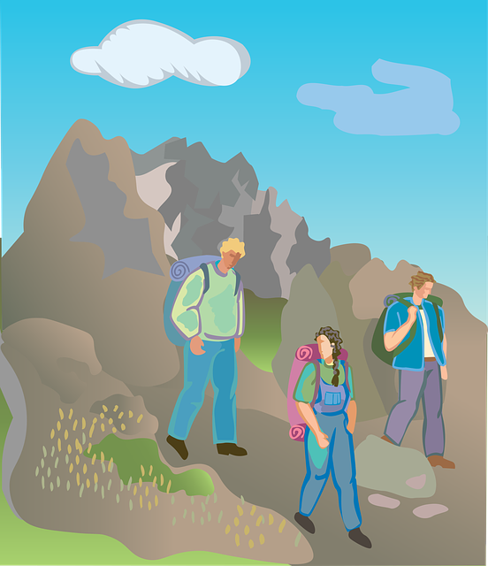

```{r setup, include=FALSE}
options(htmltools.dir.version = FALSE)
knitr::opts_chunk$set(echo = FALSE)
```


class: inverse, center, middle

# Overview

---

# R Packages for Data Science

.pull-left[

### Why is it hard?

- 1,000's of packages (12,000+)

- Packages make us more effective & more efficient

- Time changes everything

- Newer packages are better!

- Open source moves at the *speed of light*

- Dependency management is hard

- Security

]

--

.pull-right[


### Reproducibility 

> Reproducibility means your project or result
> can be recomputed reliably in another time or place

### Focus

We are focusing here on the R user, a way of thinking,
and the tools that can make your life easier

]

---

# Explorer vs. Builder

.pull-left[ 
### Explorer
```{r, fig.cap="Some explorers"}

```
]

--

.pull-right[
### Builder
```{r, fig.cap="The work of a builder"}

```
]

---

# Explorer vs. Builder

.pull-left[
### Explorer

- Values being mobile / versatile

- Values speed

- Tent for the night

- Moving each night

- Not thinking long term 
]

--

.pull-right[
### Builder

- Invests in the foundation

- Planning to stay in this location for a while

- Need future generations to enjoy

-  
]

---

background-image: url(./spectrum-notext.png)
background-size: contain
background-position: 90% 95%

# Every project lives somewhere

